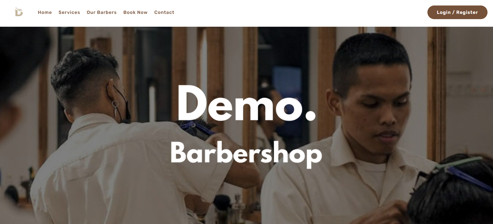
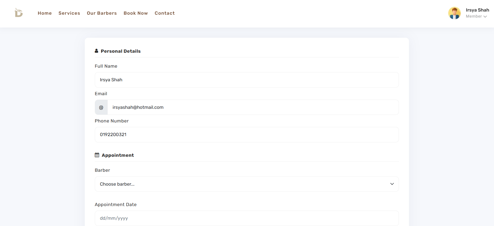
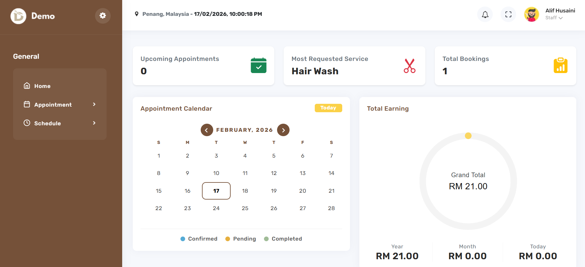
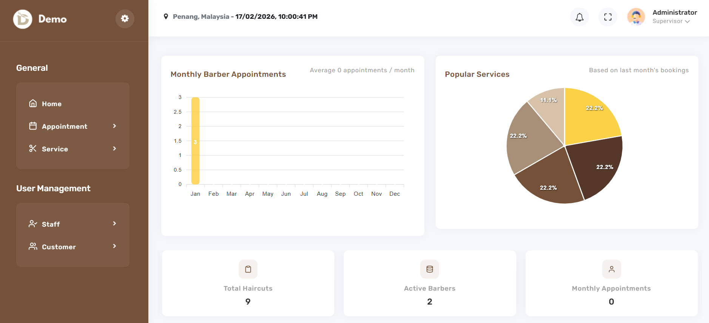

# MyBarber Appointment System

## 📌 Overview

The Appointment Management System is a web-based application developed using **Java, JSP and MySQL**, following the **MVC (Model-View-Controller) architecture**.

This system was designed to replace manual appointment booking methods with a centralized and database-driven platform. It improves operational efficiency, reduces scheduling conflicts and enhances the customer booking experience.

The system supports three primary roles:
- **Administrator**
- **Staff (Barber)**
- **Customer**

---

## Objectives

- Digitize manual appointment booking processes
- Prevent double booking and scheduling conflicts
- Enable customers to select preferred barbers
- Provide real-time appointment tracking
- Improve overall business workflow management

---

## System Architecture

The system follows the **MVC architectura pattern**:

- **Model** → Java classes handling business logic and database operations  
- **View** → JSP pages for user interface rendering  
- **Controller** → Servlets managing request handling and workflow  
- **Database** → MySQL for structured data storage  

This structure ensures:
- Better code organization
- Scalability
- Maintainability
- Separation of concerns

---

## Core Features

### Customer Module
- User registration and secure login
- Manage personal account information
- Password management
- Book appointments online
- Preferred barber selection
- View and track appointment status

### Staff Module
- Secure login authentication
- View assigned appointments
- View daily schedule
- View revenue and performance
- Update appointment status

### Administrator Module
- Secure administrator login
- Manage staff accounts and shifts
- Manage services and appointments
- Monitor monthly bookings
- Track revenue and booking analytics

---

## Key System Highlights

| Feature | Description | Business Value |
|----------|--------------|----------------|
| Preferred Barber Selection | Customers can choose their desired barber | Increases customer satisfaction |
| Role-Based Access Control | Separate access for Admin, Staff and Customer | Improved security |
| Real-Time Schedule Validation | Prevents overlapping appointments | Reduces operational errors |
| Dashboard Analytics | Displays bookings and revenue insights | Supports decision-making |
| MVC Architecture | Clean separation of logic and presentation | Easier maintenance and scalability |

---

## Technologies Used

**Backend**
- Java
- Servlet
- JDBC
- JavaMail (javax.mail)

**Frontend**
- JSP
- JSTL
- HTML
- CSS
- Bootstrap

**Database**
- MySQL

**Server**
- Apache Tomcat

---

## System Screenshots

### Landing Page


### Appointment Form


### Staff Dashboard


### Admin Dashboard


---

## ⚙️ Installation & Setup

1. Clone the repository:
   ```bash
   git clone https://github.com/IrsyaShah/my-barber-appointment-system.git
   ```

2. Import project into **Eclipse IDE**

3. Configure **Apache Tomcat Server**

4. Setup MySQL database:
   - Create a new database (`demo_barbershop`)
   - Import the provided SQL file located in the `/database` folder

5. Update database connection configuration in Java file

6. Run the project on Tomcat server

---

## Demo Accounts

For testing purposes, the system includes pre-inserted demo accounts.

You may use the following credentials:

### Administrator (Default Account)
- Username : admin
- Password : admin123

### Staff
- Email : staff@hotmail.com
- Password : 630502

### Customer
- Email : customer@hotmail.com
- Password : customer@123

---

## License

This project is licensed under the **MIT License**.

---

## Author

**Irsya Shah**  
Bachelor of Information Technology (Hons.)  
Full Stack / Backend-Specialist Developer
